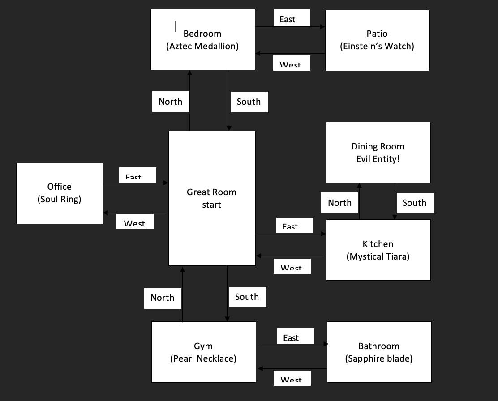

# Chicken-Text-Game

# 🐔 Chicken Ghost Buster – Text Adventure Game

### Created by Alejandro Ramirez Valdes  
📅 December 25, 2021

---

## 🎮 Description

**Chicken Ghost Buster** is a text-based adventure game written in Python. Your mission is to explore different rooms of a haunted house and collect **six magical amulets** to defeat an evil entity before it turns you into fried chicken.

Navigate using cardinal directions and pick up items along the way — but choose wisely! If you reach the Dining Room without collecting all the amulets, you’ll face a fiery end.

---

## 🧭 How to Play

- Use the following **movement commands** to explore:
  - `North`, `South`, `East`, `West`

- To collect items, use the command format:
  - `get item-name`  
    _(Example: `get Aztec Medallion`)_

- If you collect all **six amulets**, you win the game.
- If you reach the **Dining Room** without them, it's Game Over.
- You can find an **exit** through the **Patio**.
- Type `quit` at any time to end the game.

---

## 💼 Items to Collect

1. Aztec Medallion  
2. Einstein's Watch  
3. Soul Ring  
4. Pearl Necklace  
5. Sapphire Blade  
6. Mystical Tiara

---

## 🗺️ Map of the Game

Here’s a visual layout of the haunted house and where each amulet can be found:



- Start in the **Great Room**
- Navigate to various rooms to collect all **6 amulets**
- Avoid ending up in the **Dining Room** without all the items!

---

## 🛠️ Tech Used

- Python 3.x
- Text-based interface (console)

---

## 🧠 Future Improvements

- Add enemies or traps

- Create a map view during gameplay

- Improve inventory management

- Add difficulty levels

- Convert to GUI with Tkinter or Pygame

-- Contributions welcome! Feel free to fork and improve.--

___

## 🎉 Credits 

Created with 💻 and 🧠 by Alejandro Ramirez Valdes
This project was originally built as a fun learning experience in Python.

___

## 📁 How to Run

1. Clone or download the repository.
2. Make sure Python 3 is installed.
3. Open a terminal or command prompt.
4. Run the game using:

```bash
chicken_ghost_buster.py
